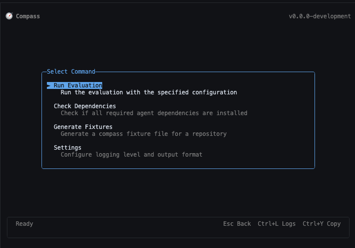
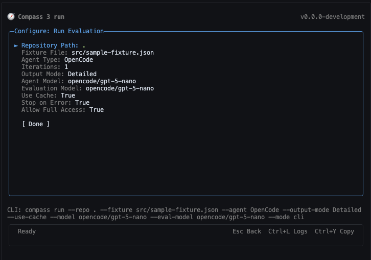
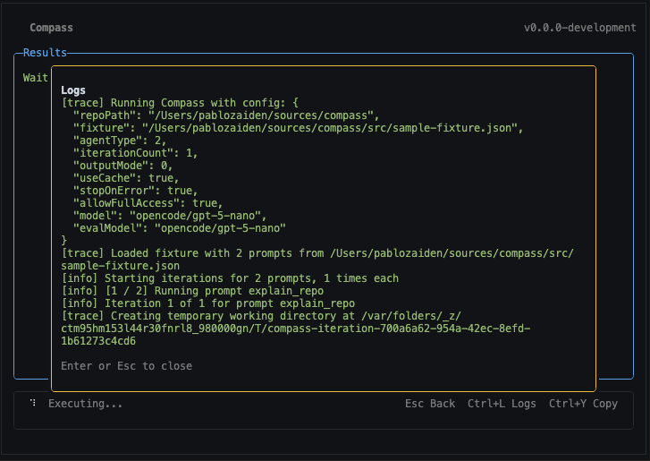
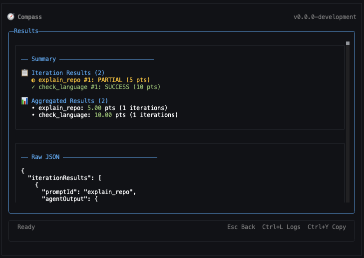

# Compass

[](https://github.com/pablozaiden/compass/releases/latest)
[](LICENSE)
[](https://bun.sh)

**A CLI and TUI tool for benchmarking AI coding agents across prompts and fixtures.**

Run agents (GitHub Copilot, Claude Code, OpenCode, Codex, Gemini) against a target repository using fixture files, then aggregate and compare results.

**[Download Latest Release](https://github.com/pablozaiden/compass/releases/latest)**

---



*Interactive Terminal UI for configuring and running benchmarks*

<details>
<summary><strong>More Screenshots</strong></summary>

---



*Configure benchmark runs with visual form-based options*

---



*Real-time log streaming during agent execution*

---



*Benchmark results with detailed scoring and analysis*

</details>

---

## Supported Agents

| Agent | Command |
|-------|---------|
| GitHub Copilot | `copilot` |
| OpenAI Codex | `codex` |
| OpenCode | `opencode` |
| Google Gemini CLI | `gemini` |
| Claude Code | `claude` |

---

## Installation

### Install Latest Release (Recommended)

Ensure `gh` CLI is installed and authenticated with the `repo` scope:

```bash
gh auth login
gh auth refresh -s repo
```

Then run the install script:

```bash
curl -fsSL -H "Authorization: token $(gh auth token)" https://raw.githubusercontent.com/PabloZaiden/compass/main/install.sh | bash
```

This downloads and installs the latest `compass` binary to `~/.local/bin`.

### Install from Source

```bash
bun local-install
```

### Run from Source

```bash
bun start
```

---

## Requirements

- Git
- [Bun runtime](https://bun.sh/) (if not using Docker or pre-built binaries)
- Agent CLI tools in your PATH (see table above)

**Optional:** `az` authenticated for Azure AI Foundry models

---

## Quick Start

### Interactive Mode (Terminal UI)

Launch the interactive Terminal UI by running compass without arguments:

```bash
compass
```

The Interactive Mode provides:
- Visual form-based configuration
- Command selection via keyboard shortcuts
- Live log streaming
- Results display with Ctrl+Y to copy to clipboard
- Cancellation support with Esc during execution

### CLI Mode

#### Run Benchmarks

```bash
compass --mode cli run \
  --repo "/path/to/target/repo" \
  --fixture "/path/to/fixture.json" \
  --agent opencode
```

#### Generate Fixtures

Auto-generate a fixture file for a repository using an AI agent:

```bash
compass --mode cli generate \
  --repo "/path/to/target/repo" \
  --agent opencode \
  --count 10
```

Optionally steer the generation with additional instructions:

```bash
compass --mode cli generate \
  --repo "/path/to/target/repo" \
  --agent copilot \
  --count 15 \
  --steering "Focus on API endpoints and error handling"
```

#### Check Dependencies

```bash
compass --mode cli check                    # Check all agents
compass --mode cli check --agent copilot    # Check specific agent
```

---

## Configuration Options

### Run Options

| Option | Required | Description |
|--------|----------|-------------|
| `--repo` | Yes | Path to the repository to evaluate |
| `--fixture` | Yes | Path to the fixture JSON file |
| `--agent` | Yes | Agent type: `Copilot`, `Codex`, `OpenCode`, `Gemini`, `ClaudeCode` |
| `--iterations` | No | Number of iterations per prompt (default: `1`) |
| `--output-mode` | No | Output format: `Detailed`, `Aggregated` (default) |
| `--use-cache` | No | Enable caching of agent responses (default: `false`) |
| `--stop-on-error` | No | Stop on first error (default: `true`) |
| `--allow-full-access` | No | Allow full repository access (default: `true`) |
| `--model` | No | Model to use for the agent |
| `--eval-model` | No | Model to use for evaluation |

### Generate Options

| Option | Required | Description |
|--------|----------|-------------|
| `--repo` | Yes | Path to the repository to analyze |
| `--agent` | Yes | Agent type |
| `--count` | Yes | Number of prompts to generate |
| `--model` | No | Model to use for the agent |
| `--steering` | No | Additional instructions to steer generation |

### Common Options

| Option | Description |
|--------|-------------|
| `--mode` | Execution mode: `cli`, `opentui` (default), `ink` |
| `--log-level` | Logging verbosity: `Trace`, `Debug`, `Info`, `Warn`, `Error` |
| `--detailed-logs` | Show detailed logs with timestamp and level |

---

## Docker

```bash
docker run --rm -ti \
  -v /absolute/path/to/target-repo:/target-repo \
  -v /absolute/path/to/fixture.json:/fixture.json \
  ghcr.io/pablozaiden/compass:latest \
  --mode cli run \
  --repo /target-repo \
  --fixture /fixture.json \
  --agent opencode
```

**Example:** Run against Compass itself:

```bash
docker run --rm -ti \
  -v $(pwd):/target-repo \
  -v $(pwd)/src/sample-fixture.json:/fixture.json \
  ghcr.io/pablozaiden/compass:latest \
  --mode cli run \
  --repo /target-repo \
  --fixture /fixture.json \
  --agent opencode
```

---

## Fixture File Format

A fixture file defines the prompts and expected outcomes for benchmarking. See [src/sample-fixture.json](src/sample-fixture.json) for an example.

```json
{
  "prompts": [
    {
      "id": "explain_repo",
      "prompt": "Describe this repo.",
      "expected": "This repo is a console tool to benchmark coding agents..."
    }
  ]
}
```

---

## Development

```bash
# Run in development
bun run start

# Run tests
bun run test

# Run agent tests (requires agent setup)
bun run test:agents

# Build type checking
bun run build

# Compile to binary
bun run compile
```

### Using a Local `terminatui` Checkout

If you have a local checkout of `@pablozaiden/terminatui` in a sibling directory:

```bash
# from the @pablozaiden/terminatui directory
bun link

# from ./compass
bun link @pablozaiden/terminatui
```

---

## Architecture

Compass uses the `@pablozaiden/terminatui` framework to provide a unified CLI + TUI experience with auto-generated forms, command routing, option validation, and cancellation support.

---

## License

[MIT](LICENSE)
